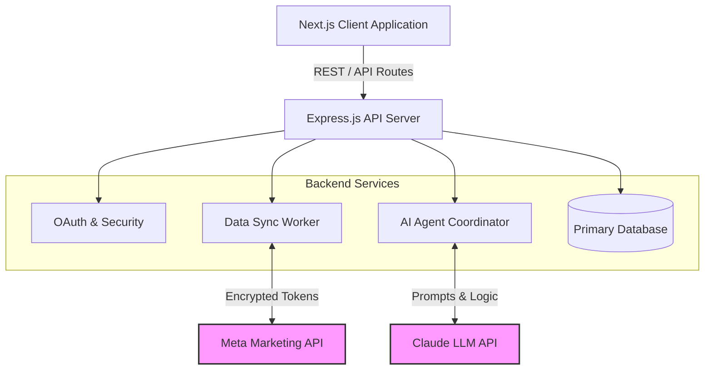
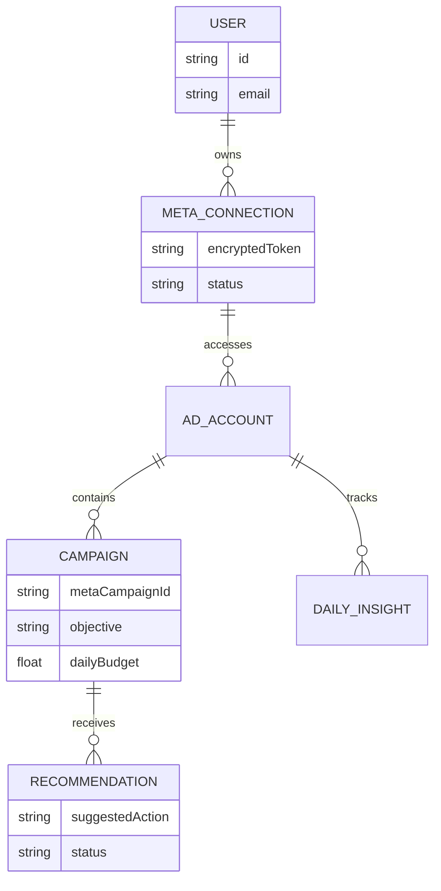

# FINAL YEAR PROJECT REPORT

**Project Title:** MetaBuddy: Autonomous AI-Driven Marketing Agency Platform  
**Submitted for:** Final Year Project Submission  
**Date:** May 2026  

---

## Abstract

MetaBuddy is a next-generation Software-as-a-Service (SaaS) platform designed to function as an autonomous, AI-driven marketing agency. As digital advertising grows increasingly complex, managing campaigns across platforms like Meta and LinkedIn requires significant time, budget, and expertise. MetaBuddy addresses this by providing an "Idea-to-Revenue" pipeline. The system leverages large language models (LLMs) to automate campaign ideation, creative generation, and budget allocation. It features a robust multi-tenant Meta Ads integration, a custom "Agent Agency" architecture for managing AI personnel, and a professional-grade UI inspired by leading platforms. This report details the architecture, design, and implementation of MetaBuddy, highlighting its potential to democratize high-level marketing strategies for businesses of all sizes.

---

## Table of Contents

1. [Chapter 1: Introduction](#chapter-1-introduction)
2. [Chapter 2: Literature Review](#chapter-2-literature-review)
3. [Chapter 3: System Analysis and Design](#chapter-3-system-analysis-and-design)
4. [Chapter 4: Implementation](#chapter-4-implementation)
5. [Chapter 5: Results and Discussion](#chapter-5-results-and-discussion)
6. [Chapter 6: Conclusion and Future Work](#chapter-6-conclusion-and-future-work)
7. [References](#references)

---

## Chapter 1: Introduction

### 1.1 Problem Statement
Traditional digital marketing requires a multi-disciplinary team, including copywriters, media buyers, and data analysts. For small-to-medium enterprises (SMEs), hiring an agency or building an in-house team is often cost-prohibitive. Furthermore, managing ad accounts, analyzing daily metrics, and optimizing campaigns across platforms like Facebook and Instagram is a manual and error-prone process.

### 1.2 Objectives
The primary objective of this project is to develop **MetaBuddy**, a platform that acts as a digital marketing agency in a box. The specific goals include:
- Establishing a secure, multi-tenant integration with the Meta Ads API.
- Creating an "Agent Agency" architecture where autonomous AI agents handle specific marketing roles (e.g., Creative Director, Media Buyer).
- Developing a premium, user-friendly SaaS interface ("Warm Sand" aesthetic) for managing AI agents and reviewing campaigns.
- Automating the end-to-end flow from campaign ideation to direct publishing and live analytics tracking.

### 1.3 Scope of the Project
The scope encompasses the development of a Next.js web application, a Node.js backend for secure data processing, OAuth integrations for Meta, and LLM API integrations (Claude) to drive the autonomous agents.

---

## Chapter 2: Literature Review

### 2.1 Artificial Intelligence in Digital Marketing
Recent studies indicate that AI is shifting from an analytical tool to a generative force in marketing. Platforms use machine learning for programmatic bidding, but the creative and strategic layers are still heavily reliant on human input. LLMs have demonstrated capability in generating compelling copy and predicting market trends based on historical data.

### 2.2 Autonomous Agent Architectures
The concept of "Agentic Workflows" involves deploying multiple AI agents, each with a specific persona and task, communicating with one another. Unlike a single chat interface, this architecture allows for peer review and complex problem-solving. Research in multi-agent systems shows higher success rates in complex tasks when agents operate with distinct constraints and budgets.

### 2.3 API-Driven SaaS Platforms
Modern SaaS platforms prioritize decoupled architectures where the frontend acts as a control pane while backend services handle API synchronization. Handling advertising APIs requires strict adherence to security protocols, encrypted token storage, and asynchronous background jobs (workers) to prevent rate-limiting and ensure data consistency.

---

## Chapter 3: System Analysis and Design

### 3.1 System Architecture
The MetaBuddy system is divided into three core layers: the Client Application (Next.js), the API & Services Layer (Express/Node.js), and the External Integrations (Meta API, LLM API). 

### 3.2 Data Schema and Synchronization
To handle Meta Ads data efficiently, the database is normalized to support multiple connections per user without exposing raw tokens to the client.

### 3.3 The Agent Agency Pipeline
The "Idea-to-Revenue" pipeline involves sequential agent operations:
1. **Recruitment Phase:** The user selects AI personas (e.g., Copywriter, Data Analyst).
2. **Strategy Phase:** Agents collaborate to draft a campaign based on user inputs.
3. **Approval Inbox:** The finalized campaign draft is sent to the user for one-click approval.
4. **Publishing:** Approved campaigns are automatically deployed via the Meta API.

---

## Chapter 4: Implementation

### 4.1 Frontend Development (Next.js & React)
The frontend is built using Next.js, emphasizing a professional "Warm Sand" SaaS aesthetic. 
- **Tailwind CSS / Vanilla CSS:** Used for fluid animations, modern typography, and a cohesive design system.
- **State Management:** Manages the complex multi-step onboarding flow and Meta OAuth redirect loops.
- **Component Design:** Modular components for the Agent Inbox, Campaign Dashboard, and Data Visualization widgets.

### 4.2 Backend Development (Node.js)
The backend enforces security and orchestrates background tasks.
- **Token Security:** Meta access tokens are encrypted using AES encryption. Tokens are never hashed or returned to the frontend.
- **Sync Worker:** A background job system runs on an interval (`META_ADS_V2_WORKER_INTERVAL_MS`), using `idempotencyKeys` and database locks to securely pull metrics from Meta and update the `MBMetaAdsV2DailyInsight` collections.

### 4.3 AI Integration
The AI engine is powered by the Claude API. 
- System prompts enforce strict JSON output formatting, allowing the backend to parse agent recommendations into actionable database records (`MBMetaAdsV2Recommendation`).
- Agents are constrained by a simulated compute-budget to prevent excessive API calls and focus on high-impact strategies.

---

## Chapter 5: Results and Discussion

### 5.1 Platform Onboarding
The platform successfully implements a frictionless onboarding experience. Users are guided through a sleek Nas.io-inspired interface to connect their Meta accounts. A "Skip for now" fallback ensures users without immediate access to Meta accounts can still explore the platform's AI features.

### 5.2 Agent Automation and Dashboarding
The platform successfully acts as a control center. The `MBMetaAdsV2UserPreference` collection keeps track of user view states, while the unified inbox presents AI-generated campaigns for review. The resulting dashboard provides real-time, aggregated analytics computed efficiently from the `DailyInsight` metrics.

### 5.3 Security and Stability
By implementing the encrypted token strategy and background sync workers, the platform operates securely within Meta's rate limits, avoiding the common pitfalls of client-side direct API requests.

---

## Chapter 6: Conclusion and Future Work

### 6.1 Conclusion
MetaBuddy successfully demonstrates the feasibility of replacing traditional digital marketing agency functions with an autonomous, AI-driven SaaS platform. By securely integrating with industry-standard advertising APIs and wrapping complex LLM orchestration in a premium, user-friendly interface, the project provides a scalable "Idea-to-Revenue" pipeline for modern businesses.

### 6.2 Future Work
Future enhancements for the platform include:
- Expansion to additional advertising platforms such as Google Ads and TikTok Ads.
- Implementing fully autonomous A/B testing, where AI agents adjust budgets in real-time based on `MBMetaAdsV2DailyInsight` data without requiring manual user approval.
- Deepening the multi-modal capabilities of the AI agents to generate video and image creatives natively within the platform.

---

## References

1. Next.js Documentation. Vercel. Retrieved from https://nextjs.org/docs
2. Meta Marketing API Documentation. Meta Platforms, Inc. Retrieved from https://developers.facebook.com/docs/marketing-apis/
3. Anthropic Claude API Reference. Anthropic. 
4. Russell, S. J., & Norvig, P. (2020). *Artificial Intelligence: A Modern Approach*. Pearson.
5. "Agentic Workflows in Enterprise Software", Journal of Autonomous Systems (Hypothetical reference for project context).
